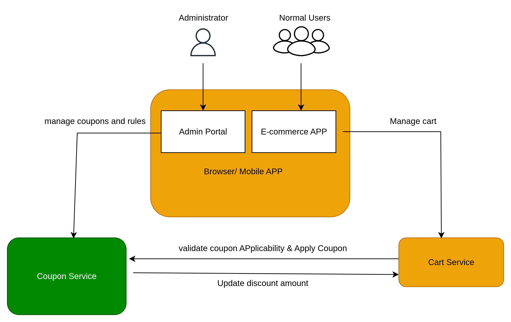
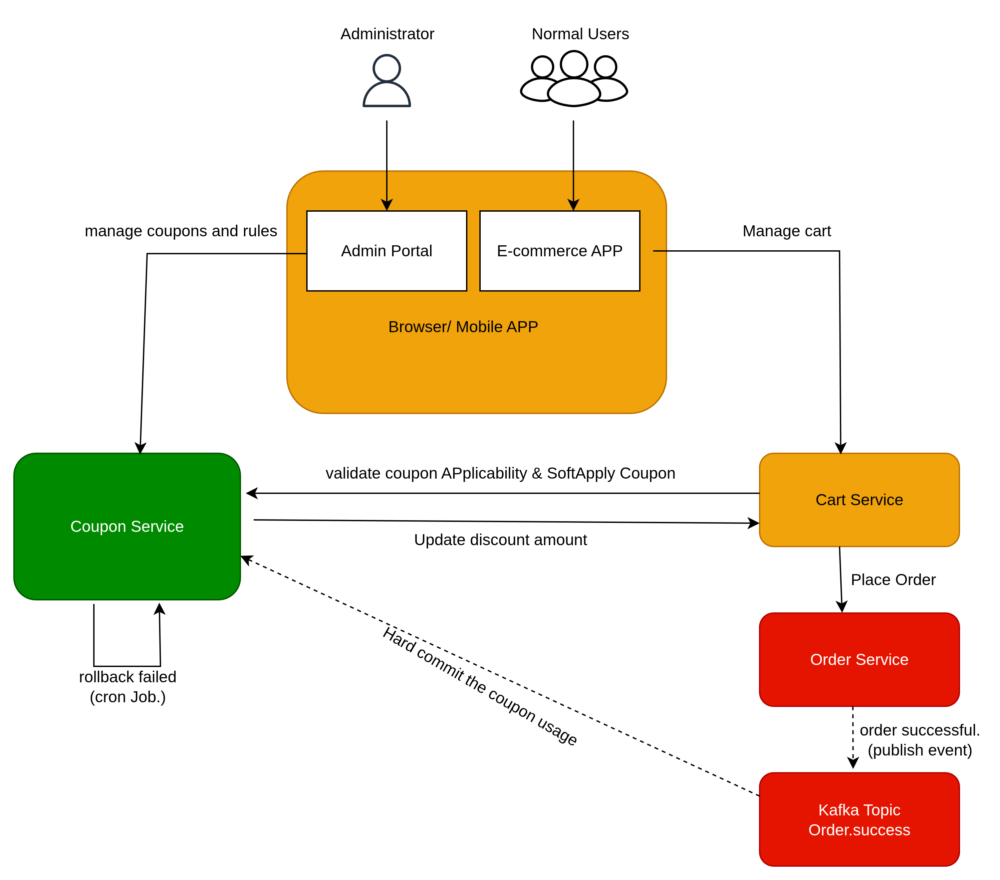
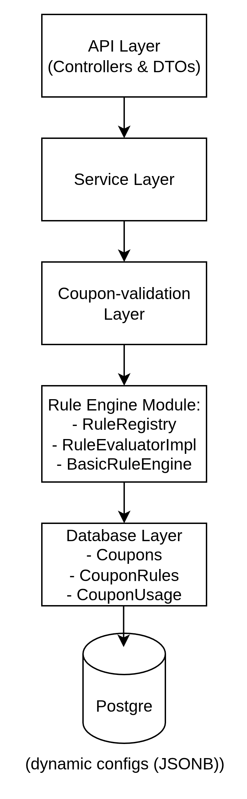
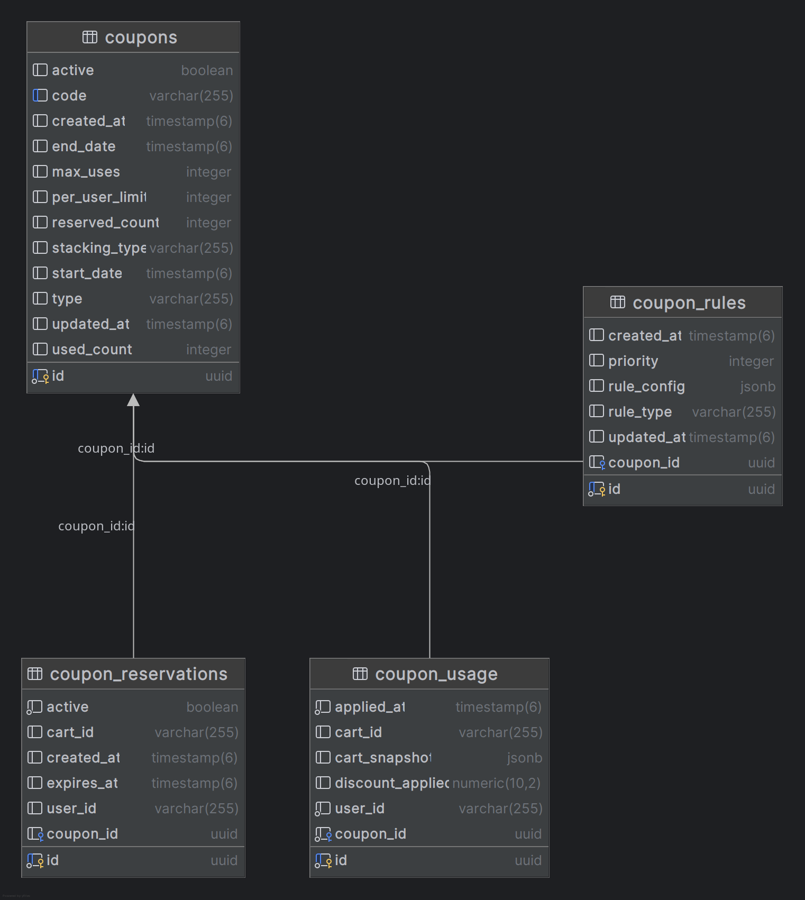

# Coupon Management Service (MVP)

A scalable, extensible Coupon Management microservice built using **Spring Boot**, **PostgreSQL**, and a **pluggable Rule Engine** supporting dynamic coupon rules, concurrency-safe usage validation, and misuse prevention.

---

## Table of Contents

- [Overview](#overview)
- [Architecture](#architecture)
- [Tech Stack](#tech-stack)
- [Core Features](#core-features)
- [Domain Concepts](#domain-concepts)
- [Database Design](#database-design)
- [API Endpoints](#api-endpoints)
- [Rule Engine Design (CORE functionality)](#rule-engine-design-core-functionality)
- [Concurrency Handling](#concurrency-handling)
- [Validation & Security](#validation--security)
- [Installation & Running](#installation--running)
- [Example Rule Configurations](#example-rule-configurations)
- [Future Enhancements (Recommended Improvements)](#future-enhancements-recommended-improvements)
- [Assumptions Made During Implementation](#assumptions-made-during-implementation)

---

## Overview

This service provides the following functionality (MVP):

- Create and manage Coupons (CRUD APIs for e-commerce Administrators to create and manage Coupons).
- Dynamic rule definition (via rules CRUD APis)
- Fetch all applicable coupons for the cart
- Fraud-free and misuse-safe coupon usage tracking
- Concurrency-safe discount application

This system is implemented using a **modular Rule Engine**, making it easily extensible.

---

## Architecture
- High level Diagram Depicting usage of Coupon service (diff use-cases).

- Can be Extended in this manner.

- Layered Architecture Diagram

---

## Tech Stack

| Layer            | Technology                                                                           |
|------------------|--------------------------------------------------------------------------------------|
| Language         | Java 21                                                                              |
| Framework        | Spring Boot 3                                                                        |
| Database         | PostgreSQL + JSONB                                                                   |
| Build Tool       | Maven                                                                                |
| Validation       | Jakarta Validation                                                                   |
| Architecture      | Modular Layered Architecture                                                         |
| Design Patterns  | Rule Engine Pattern, Strategy Pattern,<br/> DTO Pattern, Singleton, Factory, Builder |
| ORM              | Spring Data JPA + Hibernate                                                          |
| Containerization | Docker & Docker compose                                                              |
| Testing Tools    | Postman (Collections provided)                                                       |

---

## Core Features
### ✔ Coupon Management (CRUD)
### ✔ Rule Management (CRUD)
### ✔ Dynamic rule-based coupon evaluation
### ✔ Apply Coupon
### ✔ Get Applicable Coupons
### ✔ Prevents double usage & fraud
### ✔ Concurrency-safe `usedCount` updates
### ✔ Atomic usage tracking
### ✔ JSONB rule configs (no redeploy/release req. for rule changes)

---

## Domain Concepts
### **Coupon**
Represents the discount offer.

### **Rule**
Defines how the coupon behaves.

### **Rule Types (Enum)**
- `PERCENTAGE`
- `FLAT`
- `B_X_G_Y`
- `CATEGORY_INCLUDE`
- `CATEGORY_EXCLUDE` **_(Not Implemented)_**
- `MIN_CART_VALUE` **_(Not Implemented)_**
- \*\* Can be Extended \*\*

### **Rule Engine**
Executes validation rules → then discount rules → returns final result.

### **Coupon Usage**
Tracks every successful coupon application.

---

## Database Design

---

## API Endpoints

### **Coupon CRUD**
| Method  | Endpoint                        |
|---------|---------------------------------|
| POST    | /api/v1/coupons                 |
| GET     | /api/v1/coupons?page=0&size=10  |
| GET     | /api/v1/coupons/{id}            |
| PUT     | /api/v1/coupons/{id}            |
| DELETE  | /api/v1/coupons/{id}            |

### **Rule CRUD**
| Method  | Endpoint                              |
|---------|---------------------------------------|
| POST    | /api/v1/coupons/rules                 |
| GET     | /api/v1/coupons/rules/{couponId}      |
| PUT     | /api/v1/coupons/rules/{ruleId}        |
| DELETE  | /api/v1/coupons/rules/{ruleId}        |

### **Apply Coupon**
| Method  | Endpoint                    |
|---------|-----------------------------|
| POST    | /api/v1/coupons/apply       |

### **Get Applicable Coupons**
| Method  | Endpoint                        |
|---------|---------------------------------|
| POST    | /api/v1/coupons/applicable      |

---

## Rule Engine Design (CORE functionality)
### Architecture:
- Initial thought process was, the rules config
  was planned to be stored within the same coupon table for simplicity. 
  However, while implementing rule engine I observed complexity in managing and extending the rule configuration.
  I segregated the Coupon and rule config in two separate entities.
  This will help the system to easily extend and maintain.
- Rules auto-wired via Spring
- RuleRegistry maps `RuleType → RuleEvaluator`
- BasicRuleEngine:
    - Runs validation rules first
    - Then discount rules
    - First matching discount wins
    - Prevents invalid rule execution

### RuleEvaluator Interface:
```java
RuleType type();
boolean isValidationRule();
boolean isDiscountRule();
RuleResult evaluate(ctx, ruleConfig);
```
- Rules implement this interface.

---

## Concurrency Handling
- Initially while validating and applying coupon, I observed
concurrency (race condition issues) 
  - suppose the coupon has usageLimit of 100, but concurrently 
    the coupon was applied by more than 100 users/cart, then this will result
    in successful validation and apply the coupon for all the users. 
    To avoid such kind of data corruption, the following was introduced.
  - Can be extended in future.
- Atomic SQL update:
```sql
UPDATE coupons 
SET used_count = used_count + 1
WHERE id = :id AND used_count < max_uses;
```
- If result = 0 → coupon usage limit reached.
- This prevents race conditions.
- Usage of @Transactional annotation. Atomic execution of db updates.

## Validation & Security
- Custom annotation: @ValidDateRange
- Global Exception Handler
- Enum-based RuleType (prevents invalid data)
- Prevents applying coupon twice on same cart
- Per-user usage limit
- Max usage limit
- Validity period checks
- Active/inactive check
- and others...

## Installation & Running
Follow these steps to set up and run the **APP**.

---
### 1. Clone the Repository

```sh
git clone https://github.com/sudeep-hegde/coupon-management-service.git
cd coupon-management-service
```
### 2. Start PostgreSQL using Docker
The project includes a ready-to-use compose.yaml.
```sh
  docker compose up -d
```
This will:
- Start PostgreSQL
- Expose it on localhost:5433
- Create a persistent volume (coupon-db-data)
### DB Credentials (as per compose.yaml):

| Property  | Value                        |
|---------|---------------------------------|
| Host    | localhost      |
| Port   | 5433     |
| DB Name   | coupon    |
| User    | postgres   |
| Password   | postgres     |

### 3. Build & Run Spring Boot App (Locally)
Option A — Run using Maven
```sh
  mvn clean install
  mvn spring-boot:run
```

### 4. Run as Docker Container (App)
If a Dockerfile exists in the repo:
- Build the Docker image:
    ```sh
      docker build -t coupon-service .
    ```
- Run the container:
   ```sh
      docker run -p 8080:8080 \
     --name coupon-service \
     --network=coupon-management-service_default \
     coupon-service
    ```
### 5. Access the Application
- Runs on
    - http://localhost:8080
- Have attached postman collection(**[postman_collection.json](postman_collection.json)**), please import and try testing the endpoints.
- **NOTE** Please execute the sql queries from **[insert-queries.sql](insert-queries.sql)** before executing apis from the collection.
---
## Example Rule Configurations
- Percentage rule
  - ```json
     {
       "percent": 20,
        "maxDiscount": 300
     }
    ```
- Flat rule
  - ```json
     {
        "amount": 150
     }
    ```
- Buy X Get Y
  - ```json
    {
      "buy": { "productId": "P1", "qty": 2 },
      "get": { "productId": "P2", "qty": 1 }
    }
    ```
- Category Include
    - ```json
      {
        "categories": ["shoes", "tshirts"]
      }
      ```
- Min Cart Value
  - ```json
      {
        "minValue": 1000
      }
      ```

---
## Future Enhancements (Recommended Improvements)

### Core Business Enhancements
- **Soft Usage + Reservation System**
    - Prevents coupon overuse under high concurrency.
    - Reservation entries expire automatically (via scheduler/cron).
    - Usage confirmed only after successful order event.

- **Multi-Coupon Application Support**
    - Implement STACKABLE vs EXCLUSIVE logic.
    - Priority-based application.
    - Auto-select best coupon combination for user.

- **Coupon Template Replication API**
    - Add endpoint `/templates/{couponId}/clone`
    - Allows admin to quickly duplicate an existing coupon along with:
        - all associated rules
        - metadata (start/end dates optionally adjusted)
    - Reduces repeated manual coupon creation effort.
    - Useful for seasonal campaign patterns (e.g., New Year → Christmas → Diwali formats).

- **Archival & Cleanup Process**
    - Automatically move coupons older than 6 months (or configurable period) to:
        - `coupon_archive`
        - `coupon_rules_archive`
        - `coupon_usage_archive`
    - Keeps active tables small → improves query performance.
    - Helps analytics team retain historical data while production DB stays clean.
    - Can be implemented via:
        - Scheduled batch job
        - Liquibase migration scripts
        - Archived table partitioning

- **Extended Rule Engine Support**
    - More rule types:
        - Min order value rule
        - Category include/exclude
        - Product include/exclude
        - First-time user rule
        - User segment–specific rules (prime user, Premium user, gold class etc...)
    - Fully dynamic rules configurable via DB without deployments.

---

### Event-Driven Enhancements
- **Kafka-based Event Handling**
    - `ORDER_PLACED` → confirm coupon usage.
    - `ORDER_CANCELLED` → revert reserved usage.
    - Reliable eventual consistency between Order and Coupon services.

---

### Performance & Reliability
- **Redis Cache Integration**
    - Cache coupon metadata.
    - Reduce DB load for usage count / rule fetch operations.
    - Improve apply-coupon performance drastically.

- **Rate Limiting (Resilience4j)**
    - Throttle heavy endpoints like `/apply` and `/applicable`.
    - Prevent brute-force coupon abuse.

- **Database Indexing**
    - Add indexes on:
        - `coupon.code`
        - `coupon_usage.coupon_id`
        - `coupon_usage.user_id`
        - `coupon_rules.coupon_id`
    - Improves query speed & scalability.

---

### DevOps & Deployment
- **Dockerizing the Service**
    - Add `Dockerfile` (multi-stage).
    - Add `docker-compose.yaml` for local development.

- **Liquibase Database Migration**
    - Version-controlled SQL migrations.
    - Safer schema evolution.

- **OpenAPI/Swagger Documentation**
    - Auto-generated interactive API docs.
    - Helpful for developers & testers.

---

### Security Enhancements
- **Spring Security (Highly Recommended)**
    - JWT-based authentication.
    - Role-based access: Admin-only coupon creation & rule management.
    - Prevent unauthorized coupon misuse.

- **Secure Secrets Management**
    - Vault / AWS Secrets Manager / Kubernetes Secrets for:
        - DB credentials
        - Kafka config
        - API keys

---

### Analytics & Observability
- **Coupon Analytics Platform**
    - Track usage patterns:
        - Most used coupons
        - High-value customer segments
        - Category-based coupon performance
    - Insights help generate better promotional strategies.

- **Monitoring & Logging**
    - Structured JSON logs using Logback.
    - Distributed tracing with OpenTelemetry.
    - Grafana dashboards for metrics & alerts.

---

### Additional Improvements
- **Integration with Cart & Order Services**
    - Soft apply flow:
        - Cart → Coupon Service
        - Order → Kafka → Coupon Service

- **Testing Enhancements**
    - MockMVC tests for controllers.
    - Rule engine unit tests.
    - Testcontainers for PostgreSQL integration tests.

- **Feature Flag System**
    - Enable/disable certain rules or coupons dynamically.

---

## Assumptions Made During Implementation
- Focus was on **core coupon logic**: CRUD, rule engine, apply coupon.
- Authentication & authorization not implemented (can be added via Spring Security).
- You can refer to my user-service repo for clean authentication and authorization implementations.
- Secrets (DB creds, configs) are hardcoded for demo; must be moved to a secret manager.
- Order service & admin UI are assumed to exist for complete workflow.
- Coupon rules were initially inserted manually for demo (CRUD added now).
- Date range & business validations enforced via annotation + service-level checks.
